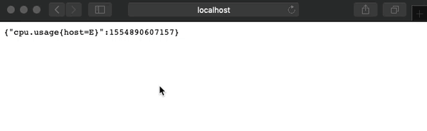

# ovh-alerts-flink-demo
A demo to show how Flink is handling OVH's alerts through [Queryable State](https://ci.apache.org/projects/flink/flink-docs-stable/dev/stream/state/queryable_state.html).



# Requirements

In order to test this demo, you will need:

* Java 8
* Gradle

# How-to

```sh
# in one terminal
gradle :flow:run

# in another terminal
gradle :api:run

# and in another(you can replace kubernetes by cloud)
watch -n 1 -d 'curl -s http://localhost:8080/api/v0/kubernetes | jq "."'
```